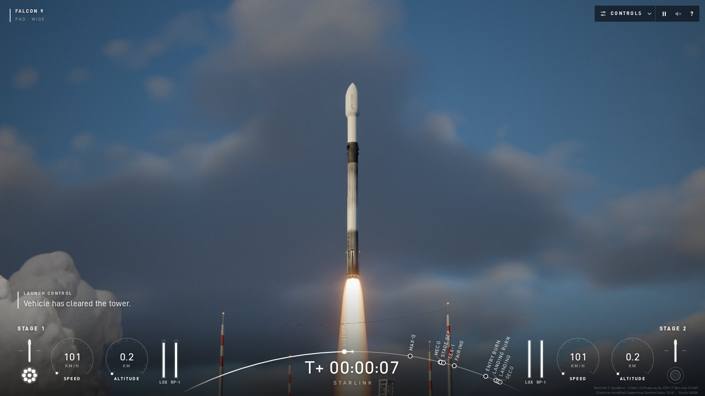
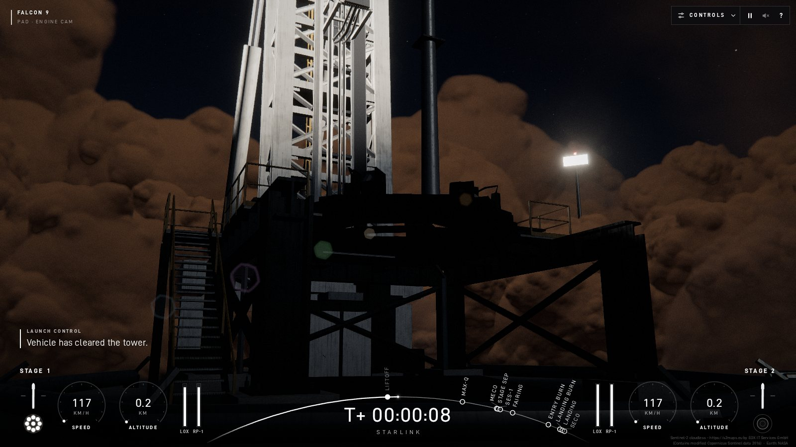
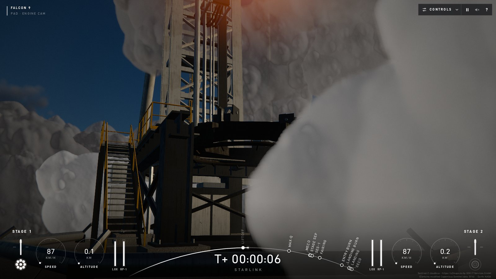
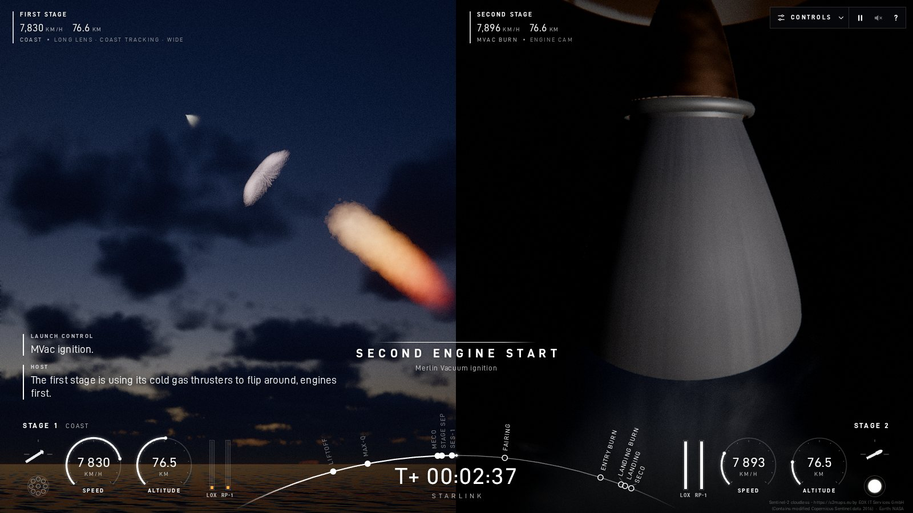
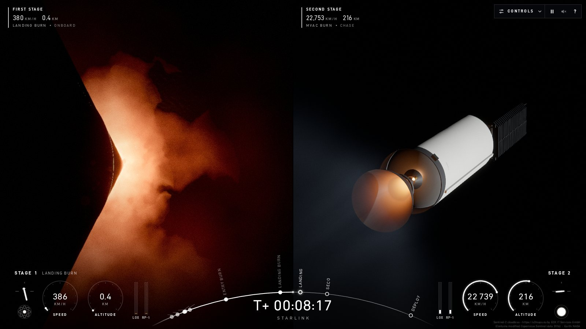

# Falcon 9 · Starlink · OCISLY

A cinematic, physically grounded 3D simulation of a Falcon 9 Block 5 Starlink launch from SLC-4E
(Vandenberg SFB), with the first stage landing on the droneship *Of Course I Still Love You*. The flight, the
guidance, the rendering and the sound are all computed live in the browser, built with Vite, TypeScript,
three.js and Web Audio.

**Live demo: [spacex.vaclavkozak.com](https://spacex.vaclavkozak.com)**



| | |
|---|---|
|  |  |
| Night ignition from the pad engine cam | Liftoff steam at T+6 s |
|  |  |
| Twilight: the booster and S2 plumes lit by the sun above a coast already in Earth's shadow, beside the S2 engine cam | Landing burn from the booster's onboard cam, beside the second stage over Earth |

The demo needs a desktop GPU with WebGL2; Chrome or Edge is recommended. The first load downloads about
45 MB of textures, terrain and cloud data. The countdown starts at T−60 s as soon as the page opens, and
browsers block audio until you interact, so click anywhere to turn on sound.

The whole project was built by [Claude Code](https://claude.com/claude-code) running Claude Opus 5.5. That
covers the code, the Blender model scripts, the shaders, the sound synthesis, the voice pipeline and this
README. It started from one spec prompt ([`prompt.txt`](prompt.txt)), and the human gave only a few steering
notes along the way. See [How it was built](#how-it-was-built).

## Run locally

```bash
npm install && npm start
```

`npm start` opens http://127.0.0.1:5173. You need Node 20+ and a WebGL2 GPU that supports float render
targets.

| Command | What it does |
|---|---|
| `npm run build` / `npm run preview` | Type-checks, builds the static site into `dist/` and serves it |
| `npm run typecheck` | Type-checks only |
| `npm run simtest` | Runs the headless flight sim in Node: the nominal mission plus 14 other scenarios (early staging, fairing timing, rough sea, manual landing), with event timelines and outcomes |
| `python3 scripts/shot.py NAME "seek=505&cam=S1:deck" …` | Takes headless GPU screenshots (Playwright + Chrome) |
| `python3 scripts/perf.py NAME "seek=150"` | Reports CPU and GPU frame cost for each scenario |

## Controls

Everything is available from the **CONTROLS** panel (top right). Press **?** in the app for the full list.

| Key | Action |
|---|---|
| Space | Pause / resume |
| L | Liftoff now (skip the countdown) |
| H | Hold / resume the countdown. Between T−3 and T−0 it aborts the launch, which recycles to T−60 |
| S / F | Separate the stages / separate the fairing, manually, at any time |
| 1–6, [ ] | Time warp 1× / 2× / 4× / 8× / 30× / 100×. The sim caps the warp by phase and drops to 1× before each key event |
| C | Cycle the camera on the main viewport |
| Esc | Restore viewports / close dialogs / leave photo mode |
| P | Photo mode: free camera, exposure, FOV. Enter saves a PNG |
| R | Slow-motion replay of the touchdown |
| M | Mute |
| K | Manual landing mode. During the landing burn: W/S throttle, X cuts the engine, arrows and A/D steer |

Viewports: click one to maximise it, drag to orbit, right-drag to pan, and use the wheel to zoom. The panel
also sets the time of day (morning / twilight / night), sea state, wind, the render quality, the
flight-proven sooty booster, and restart. A summary appears when the mission resolves.

## What's simulated

**Flight physics (`src/sim`).** 6-DOF rigid bodies are integrated with RK4 at a fixed 100 Hz step (20 Hz in
coast phases), separately from rendering, in an Earth-fixed rotating frame. The model includes:
- a spherical Earth: μ/r² gravity plus Coriolis and centrifugal terms
- the US Standard Atmosphere 1976, extended to 1000 km
- a marine boundary-layer wind with a jet stream and seeded Dryden-like gusts
- Mach-dependent axial and normal-force tables, grid fins, and shielding by the retro-propulsion plume
- engine spool transients and pressure-dependent thrust
- published Block 5 figures:
  - 9× Merlin 1D: 845 / 914 kN at sea level / in vacuum, Isp 282 / 311 s, 40–100 % throttle
  - MVac: 981 kN, Isp 348 s
  - propellant loads and dry masses, and a stack of 22 Starlink satellites

**Guidance, all closed-loop from the vehicle's actual state.**
- The second stage flies PEG-style guidance to a 215 × 300 km orbit.
- The booster runs its recovery from its own state and remaining propellant: RCS flip, a boost-back only if
  it is needed, grid-fin deploy, coast, a three-engine entry burn, and grid-fin-steered aero descent. A
  single-engine landing burn lights when the predicted stopping height reaches the deck. Legs deploy in the
  final seconds.
- Touchdown is judged against the moving deck of OCISLY, which heaves, pitches and rolls on the same sea the
  ocean renders.
- The fairing halves tumble, reenter and descend under drogues and parafoils.
- At startup a headless pre-sim of the nominal flight places the droneship about 600 km downrange.

Nominal run with default settings (`npm run simtest -- nominal`):

| Event | Sim | Spec target (approx. real) |
|---|---|---|
| Max-Q | T+1:12.6 · 27 kPa | ~T+1:10 |
| MECO | T+2:24.8 · 2.32 km/s · 63 km | ~T+2:27 |
| Stage sep / S2 ignition | T+2:27.8 / T+2:34.8 | |
| Fairing sep | T+3:15 | |
| Booster apogee | T+4:28 · 130 km | |
| Entry burn | T+6:24 · 20.9 s, 3 engines | ~T+6:20 |
| Landing burn | T+8:03.5 · 1 engine | ~T+8:05 |
| Touchdown | T+8:26.7 · 1.8 m/s · 0.6 m from centre · 2.2 t left | ~T+8:30 |
| SECO | T+8:58.6 · 215 × 301 km · i 70.2° | ~T+8:45 |
| Payload deploy | T+15:51 | |

**Your decisions change the outcome.** The flight is not scripted, so the same guidance code decides what
happens after an off-nominal choice:

| Scenario (from `simtest`) | Result |
|---|---|
| Stage at T+60 s | S2 separates at 17 kPa, pitches off the airflow and breaks up. The 279 t booster is too heavy for its cold-gas RCS, tumbles and breaks up |
| Stage at T+130 s | S2 is ~520 m/s short and runs dry suborbital. The booster boosts back and reaches the ship, but tips over with 3.9 m/s of lateral speed |
| Fairing never separated | S2 carries 1.9 t of fairing and ends up in a 186 × 215 km orbit, below target |
| Fairing at T+120 s | The payload overheats (mission failure); the booster still lands |
| Sea state 6, wind 20 m/s | Touches down 13 m off centre on a rolling deck and tips over (sea 6 with 15 m/s wind lands) |
| Manual landing, no input | Ocean impact at 266 m/s |
| Manual landing, scripted "human" pilot | Lands when it ignites on cue, 1.5 s late or 2 s early. 4 s late means a hard landing and a RUD |

**Visuals (`src/render`)**
- **Models:** procedural Blender models with 3 LODs.
  - The booster has an octaweb with 9 engines, a black interstage, titanium grid fins, carbon legs with
    telescoping pistons, N2 RCS pods and an optional sooty flight-proven finish.
  - The MVac's niobium extension heats and cools along a blackbody ramp.
  - OCISLY and SLC-4E (with its transporter-erector) are modelled too.
- **Sky:** a Hillaire-style atmosphere with transmittance, multiple-scattering, sky-view and
  aerial-perspective LUTs. It covers Rayleigh, Mie, marine haze and ozone, twilight and Earth's shadow, and
  fades to black space with real stars and the Milky Way.
- **Earth:** a NASA Blue Marble / Black Marble globe, plus 40 km and 400 km terrain patches around
  Vandenberg built from real elevation data and Sentinel-2 imagery.
- **Ocean:** a Gerstner swell shared with the ship physics, two Tessendorf FFT detail cascades, foam, sky
  reflection and sun glint.
- **Clouds:** a raymarched coastal marine layer and cumulus. They cast shadows, are lit by the plume and get
  punched through by the rocket.
- **Plumes:** raymarched and driven by ambient pressure. At the pad: a tight core with Mach diamonds in a
  huge steam cloud. At altitude: the expanded twilight "jellyfish". In vacuum: a faint MVac plume. Entry
  burn: a bow shell ahead of the booster. Landing burn: deck impingement and spray.
- **Other effects:** the TEA-TEB green flash, Max-Q condensation, RCS streaks, and plume point lights.
- **HDR post:** subject-aware auto-exposure per viewport, AgX, bloom, heat haze, long-lens shimmer, motion
  blur, analytic lens ghosts, lens dirt, chromatic aberration, vignette, grain and SMAA.

**Audio (`src/audio`)**
- **Synthesised effects:** every sound effect is synthesised in the browser. The only recordings are the
  pre-generated launch-control and host voice clips.
- **Propagation:** each listening camera hears the engines with a speed-of-sound delay, spreading, ISO
  9613-1 air absorption, and a fade as the air thins.
- **Onboard cameras** switch to structure-borne rumble.
- **Sonic booms** reach the ship r/c after the booster's Mach-1 crossing.

**Cameras (`src/cameras`)**
- **Split screen:** at stage separation the screen splits into one viewport each for S2, the booster and the
  fairing. The viewports merge back as each story ends.
- **Camera modes:** chase; onboard (booster looking down, S2 engine cam on a boom); long-lens trackers on
  the ground, the ship and the coast; the deck cam; four pad cams; cinematic moves; and free orbit.
- **Auto-director:** it cuts to key moments. It switches to the deck cam 7–8 s before touchdown, and at
  twilight it holds a wide coast shot of the jellyfish after MECO.

## How it was built

Claude Code (Claude Opus 5.5) wrote all of it: the architecture, the code, the reference-data choices, the
tuning, the diagnosis and the documentation. The human, Václav Kozák, wrote the spec in
[`prompt.txt`](prompt.txt), created the GitHub repo, provided the server for the demo, and added a few short
notes during the build: use parallel Opus subagents and skip heavyweight review loops, keep the optimisation
sensible rather than extreme, and add a user-facing quality selector. From the spec to the last feature commit took less than a
day of wall-clock time. The result is about 28k lines of TypeScript in `src/` and 3.4k lines of
Blender/texture Python.

The main Claude session acted as **integrator and director**. It wrote the contract, split the work by
directory, merged and committed, and spent most of its time looking at screenshots and deciding what to
fix next.

1. **Plan and contract.** Before any subsystem code existed, the integrator wrote
   [`ARCHITECTURE.md`](ARCHITECTURE.md) and the shared types in `src/core`. The first commit contains only
   this scaffold, placeholder subsystems and the screenshot harness. The contract fixes:
   - one Earth-fixed world frame "W" shared by the sim and the renderer
   - the floating origin, log depth and the body frames
   - the frame loop and the module interface
   - the render layers: opaque first, then VFX after a linear-depth copy
   - the lighting units: linear HDR with sun ≈ 6 and plume core 60–150, and nothing tone-maps except post
   - the shared channels: plume lights, heat-haze sources, aerial perspective, waves, quality, events
   - which directories each area owns
2. **Parallel subagents with strict ownership.** Eight Opus subagents started at once, one per area: sim,
   models, env, vfx, post, cameras, audio and ui.
   - **Ownership:** each agent edited only its own directories. It asked other areas for changes through
     written requests in its `docs/notes/<area>.md`.
   - **One tree, one committer:** all agents shared one working tree and one dev server. None of them
     committed; the integrator did.
   - **No waiting on each other:** areas built standalone benches (`models-viewer.html`, `env-test.html`,
     `vfx-test.html`, `post-test.html`). The cameras area flew a keyframed fake mission (`camfake=1`) until
     the real sim existed.
3. **Integrate and survey.** After each round the integrator type-checked, committed and ran a screenshot
   survey, rendered headless on the real GPU (`scripts/shot.py`) and tiled into contact sheets. In its final
   form the survey covered ten moments at each of the three times of day: pad, liftoff, Max-Q, staging,
   S2/fairing, entry burn, aero descent, landing burn, touchdown and post-SECO. The integrator critiqued the sheets against what real webcasts
   look like, and the list of problems became the next round's briefs.
4. **Iterate.**

   | Round | Agents | Focus |
   |---|---|---|
   | 1 | 8 | Build every subsystem against the contract |
   | 2 | 5 | Look-dev (exposure, twilight, night) · VFX polish · models + cameras · sim timeline tuning and manual landing · UI + audio checked against the real sim |
   | 3 | 3 | MVac vacuum plume and steam · lens ghosts, heat haze, S2 engine cam · cloud tiling and night lighting |
   | 4 | 3 | Performance at low quality (env, VFX) · jellyfish after seeks · twilight coast shot · low-angle pad cam |
   | Final | 1 | Twilight and night exposure |

   Within a round, the integrator sent critiques back to the same agents as follow-up messages, so they kept
   their context. More than 1,700 screenshots were taken along the way. Performance was measured with
   `scripts/perf.py` and per-pass GPU micro-benchmarks.

The per-area notes in [`docs/notes/`](docs/notes) are the agents' own working logs, including their
requests to each other. They are the most detailed record of why things are the way they are.

### What looking at the pictures caught

Most bugs here are not crashes but frames that look wrong. Several took one area proving the problem
belonged to another:

| Symptom | Cause | Fix |
|---|---|---|
| Orange crescent on the fairing nose in every twilight/night chase | It looked like a lens ghost, but post showed that it survived with ghosts off and vanished with the plume lights hidden. The unshadowed main-flame `PointLight` lit the aft-facing fairing base ring high above it | The plume-light range is capped just short of the fairing ring while S2 is stacked |
| Salmon-pink plume at twilight | Env re-rendered the frame with VFX hidden: the sky was deep blue. VFX computed its sun colour with single-wavelength ozone constants that env had already replaced | VFX imports env's atmosphere constants, so there is one set of numbers |
| Purple twilight zenith, pink booster at 75 km | Single-wavelength ozone absorption. The Chappuis band spans the whole red and green channels | Ozone coefficients integrated over each sRGB channel |
| Twilight pad lit by the sun the rocket sees at 70 km | The key light is coloured for the focus body | Earth shadow and atmospheric transmittance evaluated per fragment |
| Night ignition: launch mount flat cream-white. Twilight S2 chase: MVac a white bulb | Exposure slews at 24 EV/s, too slow for the jump from darkness to flame light, and dark space frames opened up 2–2.5 stops | A per-camera highlight cap: a floor under the exposure keeps the top percentile at most N stops over white |
| MVac nozzle a white/peach ball | The contract said "hot nozzle emissive 4–20", but 1480 K niobium is ~0.35 in scene units | A physical blackbody ramp that heats with a 7 s time constant and cools radiatively after SECO |
| Horizontal rings on the sunlit MVac extension | The lathe UVs had a constant u = 0.5, so the roughness map was read from a single column | Around-the-bell UVs and vertical streak maps |
| S2 engine cam: the bell reads as an egg | The camera looked almost straight down the bell | A boom mount 1.7 m outboard, looking in at 67° |
| Orange disc with a hole around big plumes | Screen-space ghosts mirrored the whole bright image | Analytic ghosts driven by the flux centroid and spread; broad sources get none |
| Stale cloud slab behind the pad smoke | The reduced-resolution particle target was cleared with the colour mask still off from the cloud-depth pass | The mask is forced on before clearing |
| Green TEA-TEB flash on the plume after seeking to T+145 | The ignition flash re-armed on every engine already running at the seek | Armed only on an off→on edge |
| Split-screen picture-in-picture views fading through black | The cameras' fade div and post's `view.alpha` both applied, giving alpha² | Only one fade applies |

Audio was checked the same way. `tools/audio/capture.py` records the app's master bus to WAV in headless
Chrome, together with a trace of the propagation state. `analyze.py` then measures level, clipping, band
energy and crackle skewness. The captures caught two bugs:
- **The Max-Q chase sounded 2.5 km away.** At Mach 1.5 the vehicle outruns its own sound, so the
  retarded-time solver found no root and fell back to an emission from seconds earlier. Cameras rigidly
  attached to a body now solve in an air frame that moves with that body.
- **The S2 onboard cam went silent at orbital speed.** At 7.5 km/s the camera moves 120 m per frame, which
  the camera-cut detector read as a cut every frame, dipping the mix each time.

## Key decisions and why

- **Browser and three.js instead of a native engine.** One command to run, no install, a shareable link and
  static hosting. It also made the feedback loop scriptable: any mission moment loads by URL
  (`?seek=505&cam=SHIP:deck`), so an agent can open it headless and look at the frame. The cost is the
  WebGL2 feature set. There are no compute shaders, so the ocean FFT is a Stockham radix-2 in fragment
  shaders.
- **One Earth-fixed frame, a floating origin per viewport, and a logarithmic depth buffer.** Sim and
  renderer share the same coordinates (JS doubles), with no conversion layer. Before each viewport renders,
  the world root shifts by minus the camera position, so float32 on the GPU only ever sees camera-relative
  values. Shaders that need absolute coordinates (wave phase, terrain) get the origin split hi/lo. Log depth
  covers a 3 cm near plane on the onboard cams and a 10⁸ m far plane in one pass.
- **A fixed-step, deterministic sim that knows nothing about rendering.**
  - **Headless:** it runs in Node, so `npm run simtest` checks 15 scenarios in seconds, and a full 1000 s
    mission takes under a second.
  - **Deterministic:** gusts, waves and ship motion are pure functions of settings and time. Seeking forward
    fast-forwards, and seeking backward rebuilds from T−60 in ~0.5 s. That makes `?seek=` screenshots,
    replay and restart cheap and exact.
  - **Droneship placement:** a headless pre-sim of the nominal flight positions the ship, so it sits where
    this vehicle model actually comes down.
- **Closed-loop GNC instead of keyframed animation.** The booster's rollout predictor (coast, entry burn,
  landing burn) shares its landing-burn law with the 6-DOF guidance. The divert is aero-aware: at high
  dynamic pressure it tilts the engines away from the target and lets body lift do the work. As a result,
  early staging, fairing timing, sea state, wind and manual landing genuinely change outcomes. The
  manual-landing assist is tested by a scripted pilot that sees only what the HUD shows and reacts with a
  human delay.
- **Procedural models from headless Blender scripts** (`blender/build_*.py`, textures from numpy/Pillow in
  `blender/tex/`). They are reproducible and reviewable: no licensed model downloads, nothing opaque in the
  repo, and the rig nodes (leg pistons, fin hinges, gimbals) are defined in the script. The output is under
  1 MB of Draco GLBs plus ~3.4 MB of generated textures.
- **Raymarched plumes driven by ambient pressure, not sprite particles.** One volume model covers the whole
  range, from a tight sea-level jet with Mach diamonds to a kilometre-scale translucent shell at 60 km, and
  it is lit by the same atmosphere as everything else. It combines analytic line-integrated engine cores, a
  raymarched turbulent flame, a limb-brightened expansion shell (the jellyfish), a source-flow model for the
  MVac vacuum plume and a bow shell for the retro burns. Large plumes march at half, third or quarter
  resolution with a depth-aware upsample.
- **One physically based atmosphere shared by everything.** The sky, the aerial perspective patched into
  every material, the cloud lighting, and the CPU sun colour for plumes and smoke all read the same
  constants. The twilight jellyfish is a lighting effect: the rocket climbs into sunlight above a pad
  already in Earth's shadow. The pink-plume bug above is what happens when a second copy of the constants
  exists.
- **Physical HDR units with a "webcast camera" in post.** One scene spans roughly 20 stops, from the plume
  core to the twilight sky. All materials output linear radiance in shared units, and only post decides
  what the camera sees. Post meters a histogram weighted toward the subject, then applies AgX tone mapping.
  Some cameras get their own metering rules:
  - Onboard cams use a near-fixed exposure, the way real stage cameras do.
  - Pad and deck cams cap their stop-down in daylight.
  - Pad cams at twilight and night, and chase cams in space, cap their highlights.
- **All sound effects synthesised, no sample libraries.**
  - **Engine sound:** an AudioWorklet (`src/audio/worklet.ts`) generates per-engine layers: a 15–60 Hz
    sub-bass rumble, a pink-noise roar with turbulent modulation, aero buffet, a turbopump whine onboard, and
    Merlin crackle. The crackle is built from trains of skewed N-wave shocklets with Pareto-distributed
    amplitudes and bursty Poisson timing, which is the statistical signature of real crackle.
  - **One-shot sounds:** `src/audio/synth.ts` builds the sonic-boom N-waves, TEA-TEB pops, shutdown chuffs,
    RCS puffs, clunks, touchdown, splash, explosion, surf, hull water and a reverb IR.
  - **Why synthesis:** every layer follows thrust, spool, throttle and ambient pressure continuously, which
    samples cannot do.
  - **Propagation:** each emitter keeps a history, and each listener hears the state at the retarded time
    `c·(t−τ) = |x_L − x_S(τ)|`, so Mach-cone silence and booms fall out of the solver. On top of that come
    ISO 9613-1 absorption as a distance low-pass, Doppler, thin-air fade and structure-borne sound onboard.
- **Voices from a local ML text-to-speech model, with no cloud API and no keys.**
  - **Generation:** `tools/audio/gen_callouts.py` generates every line offline with the open-weights
    **Kokoro-82M** model through `kokoro-onnx`.
  - **Voices:** launch control is `am_michael`, the host is `af_heart`, and net chatter rotates through six
    other Kokoro voices.
  - **Text source:** the lines come from `CALLOUT_LINES` in `src/sim/callouts.ts`, imported directly, plus
    extras in `tools/audio/lines.json`.
  - **Pronunciation:** jargon is respelled for the TTS: MECO → "Meeko", MVac → "Em-vack", max Q → "max
    cue", TEA-TEB → "tee ee ay, tee ee bee".
  - **Launch-control radio chain** (our own numpy/scipy code): a 255–4250 Hz band-pass (a strict
    300–3400 Hz phone band made /s/ and final plosives unintelligible), a 1.9 kHz presence peak,
    compression, tanh saturation, faint net hiss, and squelch key-up and tail bursts. The host voice gets
    only a high-pass and light compression.
  - **Output:** every clip is loudness-normalised (BS.1770) and encoded to 64 kbps mono MP3. That gives 151
    clips (~2.6 MB) in `public/audio/callouts/`.
  - **Intelligibility check:** `verify_callouts.py` transcribes each clip with Whisper (`faster-whisper`
    base.en) to confirm it survives the radio treatment.
  - **Fallback:** a line with no clip falls back to the browser's `speechSynthesis`.
- **Real data where it is free:**
  - NASA Blue Marble / Black Marble and the cloud composite
  - Sentinel-2 cloudless imagery and Mapzen terrain tiles around Vandenberg, with an offshore DEM cleanup so
    the coastline is right
  - the Yale Bright Star Catalogue (~9k stars, with colours) and NASA's Milky Way map
  - a Meeus-series ephemeris for the sun and moon
- **One sea for rendering and physics.** `src/core/waves.ts` (a Gerstner sum) is the single source of truth
  for the low-frequency sea surface. The ocean shader draws it, and the droneship's heave, pitch and roll
  sample it over the hull. The FFT detail is high-passed above it, so the ship rides exactly the waves you
  see.
- **Adaptive quality with a user override.** There are four levels, and every module scales its own cost.
  AUTO moves between the levels by frame time. The manual selector, remembered across visits, was added at
  the human's request.

## Render quality

The setting is in the panel under RENDER QUALITY. AUTO (the default) drops a level after 1.5 s above 19 ms
per frame and raises one after 6 s below 13 ms. The line under the selector shows the active level and fps.
`?quality=` overrides the setting.

| | LOW | MEDIUM | HIGH | ULTRA |
|---|---|---|---|---|
| Render scale | 0.6 | 0.75 | 0.9 | 1.0 |
| Cloud march steps · resolution | 24 · ¼ | 32 · ⅓ | 44 · ½ | 60 · ½ |
| S1 plume march samples | 16 | 24 | 36 | 52 |
| Particle cap | 1400 | 2400 | 3600 | 5000 |
| Ocean FFT grid | 128² | 128² | 256² | 256² |
| Post | no SMAA, CA, flares or motion blur | + SMAA, CA, flares | + motion blur | + 4× MSAA |

### URL parameters (testing and screenshots)

| Parameter | Meaning |
|---|---|
| `seek=<s>` | Fast-forward to that mission time |
| `pause=1` | Start paused |
| `warp=<n>` | Start at that time warp |
| `tod=morning\|twilight\|night` | Time of day (default twilight) |
| `sea=0..6` / `wind=<m/s>` | Sea state / wind speed |
| `soot=0\|1` | Flight-proven sooty booster off / on |
| `manual=1` | Manual landing mode |
| `quality=auto\|low\|medium\|high\|ultra` | Render quality |
| `cam=<BODY>:<mode>[:preset]` | Camera, e.g. `S1:deck`, `S2:onboard_engine`, `S1:long_lens:ground`, `S1:pad:engine` |
| `split=1` | Together with `cam=`, keeps the automatic split screen |
| `director=0` | Turns off the auto-director |
| `clouds=0..1.5` | Scales the cloud coverage (0 = clear sky) |
| `hud=0` / `labels=0` | Hides the HUD / the viewport labels |
| `hud=min` | Minimal broadcast HUD (clock, stage, speed and altitude, event titles) for vertical video |
| `step=1` | No render loop; an external driver advances the sim with `__app.frame(dt)` (video capture) |
| `dpr=<n>` | Raises the device-pixel-ratio cap (default 2), e.g. `dpr=4` for 9:16 video capture |

## Architecture

Read [`ARCHITECTURE.md`](ARCHITECTURE.md) first. It is the contract between subsystems: frames, floating
origin, the frame loop, render layers, lighting units and ownership. Each area keeps its working notes in
`docs/notes/<area>.md` and its asset sources in `docs/assets/<area>.md`.

```
src/core      shared contract: frames (W = Earth-fixed pad frame), vehicle spec, waves, snapshot types, events
src/app       frame loop, floating origin per viewport, adaptive quality, replay, actions
src/sim       6-DOF flight sim + GNC (no rendering deps; also runs in Node for scripts/simtest.ts)
src/render    env (sky/earth/terrain/ocean/clouds) · vehicles (GLB rigs) · vfx (plumes/particles) · post (HDR)
src/cameras   viewports, rigs, director, labels
src/audio     Web Audio engine, AudioWorklet synth, propagation, callouts
src/ui        webcast HUD, controls, captions, manual-landing HUD, summary, photo mode
blender/      headless Blender model builders + numpy texture generators
tools/audio/  offline callout generation (Kokoro TTS), capture and analysis
tools/video/  offline video rendering: cut lists, frame-stepped takes, audio takes, subtitles, assembly
scripts/      shot.py (headless GPU screenshots), perf.py (frame cost), simtest.ts
docs/         per-area notes and asset licenses
```

The screenshot harness runs headless Chrome through ANGLE on Mesa's D3D12 Gallium driver. That way WSL2
renders on the host GPU instead of falling back to software rendering, so the shots show the real shaders
at real cost.

## Hosting

It is a static site with no backend: the sim, the rendering and the audio all run in the visitor's browser.

```bash
npm run build     # type-check + Vite build → dist/
```

- **Size:** `dist/` is about 55 MB, mostly env textures (~25 MB) and binary terrain and cloud data
  (~23 MB). With gzip a first visit transfers about 45 MB. JPEGs, MP3s and Draco GLBs barely compress, but
  the `.bin` data does (24 → 18 MB), so enable gzip or brotli for `application/octet-stream`.
- **Serve it from the domain root.** Some env assets are requested by absolute path (`/textures/...`,
  `/data/...`), so a subpath deployment such as a GitHub Pages project URL will not find them.
- **Caching:** Vite content-hashes only the files in `/assets/`, so those can be cached forever. Everything
  copied from `public/` keeps its name, so give it a shorter cache lifetime.
- **Where:** any static host works: Cloudflare Pages, Netlify, S3 + CDN, or GitHub Pages on a custom domain.
- **Analytics:** `vite.config.ts` adds the live demo's self-hosted Plausible snippet to the production build
  only (the dev and capture servers never load it). Remove or replace it in a fork.

The live demo runs from the [`Dockerfile`](Dockerfile) in this repo. It builds the bundle in a Node stage
and serves `dist/` from `nginx:stable-alpine` with [`docker/nginx.conf`](docker/nginx.conf), which sets gzip
(including `.bin`) and the cache headers. On the server the container sits behind a shared nginx reverse
proxy and Cloudflare, uses a few MB of RAM and almost no CPU.

```bash
docker build -t spacex-launch-simulation .
docker run --rm -p 8080:80 spacex-launch-simulation   # → http://localhost:8080
```

## Rendering a video

`tools/video/` turns the sim into trailer-style edits: 16:9 4K60 for YouTube, subtitled 1080p for X, LinkedIn
and Facebook, and 9:16 clips for TikTok, Reels and Shorts. The browser cannot capture 4K at 60 fps in real
time, so the video is not a screen recording. Each cut list in [`tools/video/cuts/`](tools/video/cuts)
defines the camera, mission-time range, transition, title cards, subtitles and deliverables of every shot.
Each shot is rendered frame by frame and then assembled with ffmpeg.

```bash
npx vite --config tools/audio/vite.audio.config.ts   # private server, no HMR (edits can't reload a capture)
export SIM_URL=http://127.0.0.1:5199
python3 tools/video/render.py tools/video/cuts/launch.json    # 4K60 video takes (~0.3-0.5 s per frame)
python3 tools/video/audio.py tools/video/cuts/launch.json     # audio takes + callout log, real time
python3 tools/video/assemble.py tools/video/cuts/launch.json  # edit master + deliverables
```

- **Video takes.** The page runs with `?step=1`, so it has no render loop, and the script calls
  `__app.frame(1/60)` for every frame. Timers run on Playwright's fake clock, and CSS animations (HUD titles)
  are stepped on the same virtual clock. A frame can take half a second to render and the take is still
  perfectly smooth. The canvas and the HUD render natively at the output resolution; the HUD is not
  upscaled:
  - 16:9 renders 1920×1080 CSS at device pixel ratio 2, for 3840×2160.
  - 9:16 renders 540×960 CSS at DPR 4 (`?dpr=4` lifts the app's cap of 2). That supersamples the
    1080×1920 deliverable and gives the phone layout of the HUD (`hud=min`).

  CDP screenshots are piped to x264 as 4:4:4 CRF 10. Every take starts with a few seconds of pre-roll that
  is rendered but not kept, so auto-exposure, smoke and plume history settle first. Short edits reuse parts
  of a longer cut's takes (`"take": "launch/03_ignition"`).
- **Audio takes.** Web Audio cannot be frame-stepped, so each shot is played once in real time at low
  render quality. First the page dry-runs the shot, which compiles every shader and builds every effect, and
  then seeks back. The recording itself drives the sim from the AudioContext clock (it never falls more
  than one frame behind), and the AudioWorklet tap reports the sample frame of its first sample. Each WAV
  therefore starts exactly at the shot's first mission time.
- **Subtitles.** The callout player logs every voice clip it starts, on the audio clock. The assembler maps
  those clips onto the edit timeline and writes two files:
  - an `.srt` of whole phrases, for upload as closed captions
  - an `.ass` of short chunks in D-DIN, which the deliverables burn in

  In 9:16 the burned-in subtitles stay out of the zones the TikTok, Reels and Shorts UI covers.
- **Assembly.** Hard cuts and dissolves (video `xfade` plus audio `acrossfade`), and title cards drawn with
  PIL. The mix is resampled to 48 kHz and loudness-normalised to −14 LUFS / −1 dBTP in two passes. The
  script writes a 4:4:4 edit master, then the deliverables listed in the cut: `4k`, `1080p` or `vertical`,
  each with or without burned-in subtitles.

## Known limitations

**Physics and timing**
- **SECO is late.** It comes at about T+8:59 instead of the webcast's ~8:45. The published second-stage
  propellant load and MVac mass flow force a ~383 s burn, whatever the guidance does.
- **MECO is early and Max-Q is low.** MECO is ~2 s early, which protects the booster's 26 t landing reserve.
  Max-Q peaks at 27 kPa, lower than commonly quoted. The time from entry burn to touchdown is ~123 s against
  a real ~130 s.
- **S1 RCS is stronger than spec.** It is modelled at 2× the per-nozzle thrust so that flips reach ~5°/s.
- **Fairing heating is a proxy.** The free-molecular heating term ½ρV³ is not physical below ~80 km; it
  only decides whether the payload is damaged by an early fairing separation.
- **Chase audio is cinematic licence.** Chase, orbit and onboard cameras hear their vehicle through a
  co-moving air frame. In still air, a chase camera at Mach 1.5 would sit in silence behind the Mach cone.

**Rendering**
- **Clouds do not hide plumes.** Plumes and particles are occluded only by opaque geometry, so low cumulus
  does not hide far plumes in the twilight coast shot.
- **The far-field twilight shells are too soft.** They are softer than in real footage and have less
  filament structure. The S1 ascent trail reads as a smooth orange tube, and the post-MECO remnant reads as
  a lens rather than a full dome. A remnant rebuilt after a seek is approximate.
- **The coast site's foreground is low-res.** From the 200 km coast site the foreground land and ocean look
  low-res, and clouds partly hide the twilight horizon band.
- **The Los Angeles city core is saturated** in the Black Marble night lights.

**Performance and platform**
- **Performance was only measured on an RTX 5070 Ti** (through WSL2, ANGLE and D3D12). The figures for
  GTX 1650-class GPUs are scaled estimates, not measurements. Lower-end GPUs should use AUTO or LOW.
- **AUTO tops out at HIGH on a 60 Hz display,** because vsync caps the frame time. Pick ULTRA by hand if you
  want it.
- **The environment reflection probe causes a small frame-time spike.** It updates periodically (every 40
  frames at low quality) and costs ~0.5 ms on the dev GPU in that frame.
- **The first load is ~45 MB.** Textures and env data are plain JPEG/PNG and raw binaries, with no
  GPU-compressed formats yet.
- **Phones and tablets were not a target.** The HUD has a narrow portrait layout, but performance on mobile
  GPUs is untested.

## Assets and licenses

All models, VFX textures and sound effects are generated procedurally by the scripts in this repo, and the
callout voices are generated offline with an open-weights TTS model. Third-party data is listed below;
details are in `docs/assets/*.md`.

- NASA Blue Marble Next Generation, Black Marble 2016, Blue Marble clouds, SVS Deep Star Maps 2020
  (Milky Way) and CGI Moon Kit: public domain (NASA).
- Yale Bright Star Catalogue, 5th ed.: public domain.
- Terrain Tiles (Mapzen / AWS Open Data; sources include USGS 3DEP/NED, SRTM, GMTED and ETOPO1): see the
  tilezen/joerd attribution.
- **Sentinel-2 cloudless — https://s2maps.eu by EOX IT Services GmbH (Contains modified Copernicus
  Sentinel data 2016)**, CC BY 4.0.
- D-DIN font by Datto Inc., SIL OFL 1.1 (plus a derived tabular-figures subset, same license).
- Kokoro-82M TTS model and voices (Apache-2.0), used offline to generate the callouts, run through
  kokoro-onnx (MIT). Build-time only, not shipped: espeak-ng for phonemes (GPL-3.0) and faster-whisper for
  the intelligibility check (MIT).
- Google Draco decoder (Apache-2.0).

This is a fan-made simulation and is not affiliated with SpaceX.
